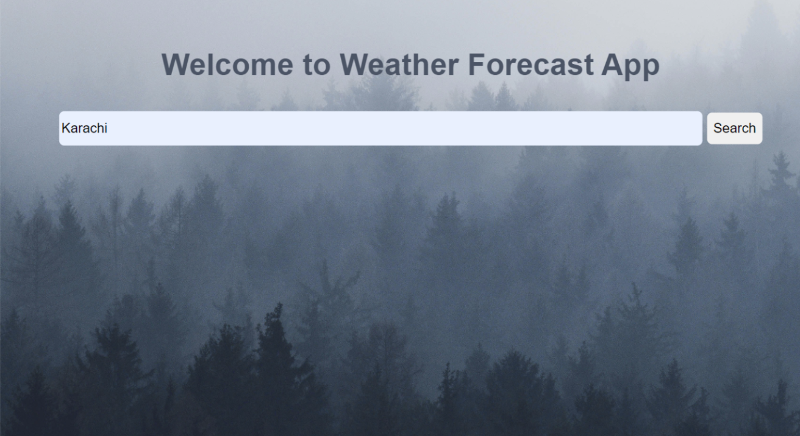
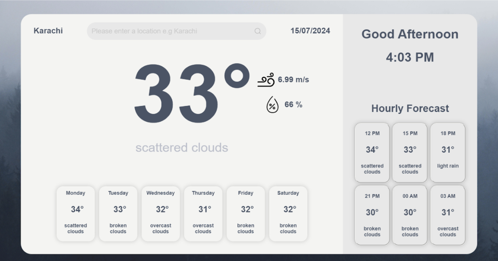
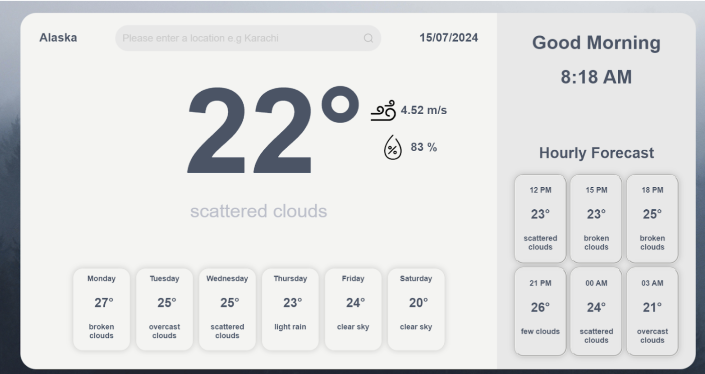

Project Features
=

Frontend:
-
1. Search Bar Functionality: Users can input a city name to search for weather information.
2. 5 Day Weather Forecast: Display weather data for the next five days.
3. Weather at Different Times: Show weather updates with a 3-hour interval on the selected day.

Backend:
-
1. Handle Search Request: Accept city names and fetch weather data from the OpenWeatherMap API.
2. Return Weather Data: Serve formatted weather data to the frontend.

Project Structure
=

Frontend Structure:
-
* HTML File: HTML file for the main search interface where users input city names.
* EJS File: EJS template to display weather information retrieved from the backend.
* CSS Styling: CSS stylesheet for styling the web application.

Backend Structure:
-
* Server Setup: Node.js with Express.js for handling HTTP requests and responses.
* Middleware: Middleware for parsing input, handling errors, and sending appropriate responses.
* External API Integration: Utilize Axios for fetching weather data from the OpenWeatherMap API.
* Routes:
   * GET /: Route to render the home.html page for searching weather information.
   * POST /: Endpoint to receive city name input, fetch weather data, and render it using the.ejs template.

 
FINAL PROJECT
=
Home Page
-

This is the homepage that greets and asks for a location to show the weather of that location. Requests then will be forwarded to the backend to call API and do the rest of the work! 
In the above search bar I searched for Karachi so now we will go to the main page.

Main Page
=

This is how our frontend looks: in the center, there is the current temperature of a searched location and other things like wind speed, humidity, and weather description, like scattered clouds in this example.

On the top left and top right of the first rectangle that has a white color, it shows the searched location and date, respectively. And in the middle of them is a search bar that users can use to check the weather at any other location. 

In the bottom of this first rectangle, there is weather for the next 5 days in this example, from Tuesday to Saturday, and these cards have a hover effect on them.

In the second rectangle, it greets the user based on the current time in the searched location, dynamically changing the greeting to 'Good Morning,' 'Good Afternoon,' or 'Good Night.' It then shows the current local time and an hourly forecast that includes the time, weather, and a weather description in 3-hour intervals.



Database
=
We'll use the database as a cache. When a place is searched for the first time, it is first retrieved from the API and then entered into a database in json format. Instead of contacting the API, data will be retrieved from the database if the same place is searched again in an hour. The same place that was searched will have new data from the API overwritten after an hour.

Prerequisites
=
* Node.js: Ensure Node.js is installed. Download and install from nodejs.org.
* PostgreSQL: Ensure PostgreSQL is installed and running. Download and install from postgresql.org.
* Git: Ensure Git is installed. Download and install from git-scm.com.

# Deployment Guide

## Clone the Repository
Open a terminal and run:
```
git clone <repository-url>
cd <repository-directory>
```

## Install Dependencies:
Run the following command in the project directory:
```
npm install
```
## Set Up Environment Variables:
Create a .env file in the root directory of your project and add the following variables:
```
DB_USER=your_db_user
DB_HOST=your_db_host
DB_DATABASE=your_db_name
DB_PASSWORD=your_db_password
DB_PORT=your_db_port
API_KEY=your_openweathermap_api_key
```
Replace the placeholder values with your actual database credentials and API key.

## Database Setup:
Create the required database and tables in PostgreSQL. Connect to your PostgreSQL server using a tool like psql or pgAdmin and run:
```
CREATE DATABASE your_db_name;
CREATE TABLE weather (
  location VARCHAR(255) PRIMARY KEY,
  data JSONB NOT NULL,
  last_updated TIMESTAMP NOT NULL
);
```
## Run the Application:
Start your application with:
```
npm start
```
This will start the server on the port specified in your .env file (default is 3000).

## Access the Application:
Open a web browser and navigate to ```http://localhost:3000``` to access your application.

I am using the "https://dribbble.com/shots/15524720-Weather-web-app" template from Masood Ahmad as inspiration for the design of this project.
